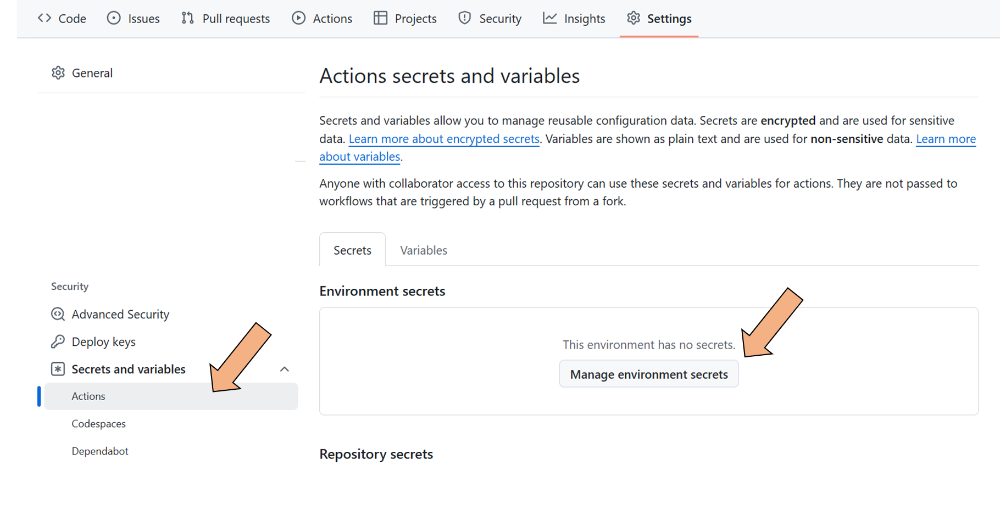
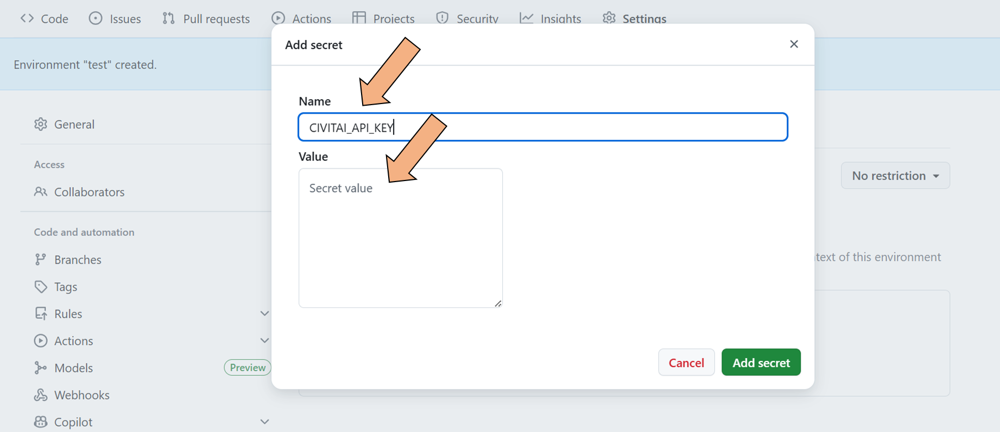
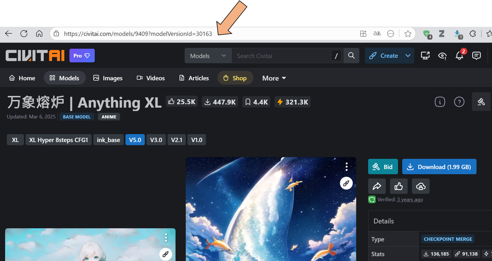

1. Fork this project
2. Create an environment and give it any name you like.

  

  
  3. Add a secret named CIVITAI_API_KEY. You can obtain the API value from the following link. (https://education.civitai.com/civitais-guide-to-downloading-via-api/).

  

4. Modify the prompt in prepare_data.py if needed. If prepare_data.py exists in the root directory, the CI tool will overwrite the downloaded file; otherwise, the default value from the server will be used.
5. Check modelVersionId and run GitHub Action.

  

